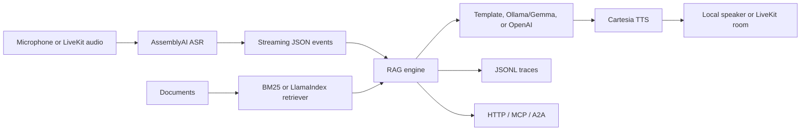

# Real-Time Voice RAG Agent

A working real-time Voice RAG project that turns static document search into natural voice conversation. The local demo connects microphone input, AssemblyAI real-time transcription, document-grounded RAG retrieval, Ollama/Gemma reasoning, and Cartesia text-to-speech playback through one streaming JSON event pipeline.

The core can also run offline for tests using deterministic local components. Provider adapters are kept separate for LiveKit room transport, AssemblyAI transcription, Ollama/Gemma or OpenAI reasoning, Cartesia TTS, MCP tools, and A2A task interoperability.

## Real Voice Demo

This project supports a working local voice RAG demo:

Mic → AssemblyAI Streaming ASR → RAG retrieval → Ollama/Gemma reasoning → Cartesia TTS → Mac speaker output

### Run locally

```bash
cp .env.example .env
# Fill ASSEMBLYAI_API_KEY and CARTESIA_API_KEY in .env

./scripts/run_voice_live.sh
```

Expected event stream:

```text
asr.transcript
retrieval.completed
retrieval.chunk
answer.delta
tts.audio
answer.completed
```

The live demo uses:

- AssemblyAI for real-time microphone transcription.
- BM25-based local RAG retrieval over sample documents.
- Ollama/Gemma for local reasoning.
- Cartesia for text-to-speech playback.
- ffplay/FFmpeg for local audio output.

## What It Does

- Streams one JSON event envelope across CLI, HTTP, A2A, MCP, and voice transports.
- Retrieves grounded chunks from local documents with deterministic BM25 for tests.
- Supports optional LlamaIndex retrieval for production vector or hybrid search.
- Streams model deltas from Ollama's local JSON API or OpenAI's Responses API.
- Runs a real local voice path with AssemblyAI ASR and Cartesia TTS.
- Keeps ASR, retrieval, reasoning, TTS, tracing, and transport as separate adapters.
- Records trace JSONL files for latency analysis and eval debugging.

## Quick Start

```bash
python3 -m venv .venv
source .venv/bin/activate
pip install -e .
PYTHONPATH=src python3 -m voice_rag_agent.cli query "How does the agent keep latency low?"
```

Stream the same turn as NDJSON:

```bash
PYTHONPATH=src python3 -m voice_rag_agent.cli query "What do MCP and A2A expose?" --stream
```

Simulate a voice turn without real ASR/TTS providers:

```bash
PYTHONPATH=src python3 -m voice_rag_agent.cli voice-demo "What services are used for transcription and TTS?"
```

Run the real local voice demo after setting `.env`:

```bash
./scripts/run_voice_live.sh
```

Run evals:

```bash
PYTHONPATH=src python3 -m voice_rag_agent.cli eval
```

Run the HTTP API after installing the API extra:

```bash
pip install -e ".[api]"
PYTHONPATH=src python3 -m voice_rag_agent.cli serve --host 127.0.0.1 --port 8000
```

## Configuration

Copy `.env.example` to `.env` and fill only your local secrets in `.env`.

Do not commit `.env`.

The offline default is:

```bash
VOICE_RAG_REASONER=template
VOICE_RAG_DATA_DIR=data/sample_docs
```

For Ollama/Gemma:

```bash
ollama pull gemma3:4b
VOICE_RAG_REASONER=ollama
OLLAMA_MODEL=gemma3:4b
```

For OpenAI, set both values explicitly:

```bash
VOICE_RAG_REASONER=openai
OPENAI_API_KEY=...
OPENAI_MODEL=...
```

For the real voice demo:

```bash
ASSEMBLYAI_API_KEY=...
CARTESIA_API_KEY=...
CARTESIA_VOICE_ID=db6b0ed5-d5d3-463d-ae85-518a07d3c2b4
VOICE_RAG_REASONER=ollama
OLLAMA_MODEL=gemma3:4b
```

## Architecture



The core package is dependency-light so tests and demos run locally. Production integrations live behind narrow adapters in `src/voice_rag_agent/integrations`, `src/voice_rag_agent/protocols`, and `src/voice_rag_agent/voice`.

## Project Layout

- `src/voice_rag_agent/rag`: document loading, BM25 cache, prompting, streaming RAG engine.
- `src/voice_rag_agent/llm`: deterministic, Ollama, and OpenAI reasoners.
- `src/voice_rag_agent/voice`: ASR/TTS protocols, VAD, audio sink, and voice orchestration.
- `src/voice_rag_agent/protocols`: A2A and MCP surfaces.
- `src/voice_rag_agent/api.py`: FastAPI query and streaming endpoints.
- `data/sample_docs`: small corpus for demos and tests.
- `scripts/run_voice_live.sh`: one-command local voice demo runner.
- `tests`: standard-library unittest suite.

## Latency Strategy

The agent optimizes perceived latency by triggering retrieval only on final ASR transcripts, caching repeated queries, keeping top-k small, streaming answer deltas, and sending sentence-level chunks to TTS as soon as text is ready.

Trace files are written to `traces/<trace_id>.jsonl` when `VOICE_RAG_ENABLE_TRACING=true`. Each trace records event timings and spans for retrieval and reasoning.

## Current Status

Working:

1. Offline text RAG demo.
2. Streaming NDJSON query mode.
3. Simulated voice turn through CLI.
4. Real local voice demo with AssemblyAI ASR, Ollama/Gemma reasoning, and Cartesia TTS.
5. MCP and A2A protocol surfaces.
6. FastAPI query and streaming endpoints.

Next improvements:

1. Complete `integrations/livekit_worker.py` for real LiveKit room transport.
2. Add PDF, DOCX, and web document ingestion.
3. Promote LlamaIndex or hybrid retrieval as a first-class production retrieval option.
4. Add richer latency metrics for ASR, retrieval, LLM time-to-first-token, TTS first-audio, and full turn latency.
5. Export traces to OpenTelemetry if the `observability` extra is installed.

## Production Wiring

The RAG engine does not care which transport calls it. That makes local evals, HTTP requests, MCP tool calls, A2A tasks, and live voice turns share one behavior.

The current local voice demo uses microphone input and local speaker output. LiveKit room transport is the main remaining production transport layer.
