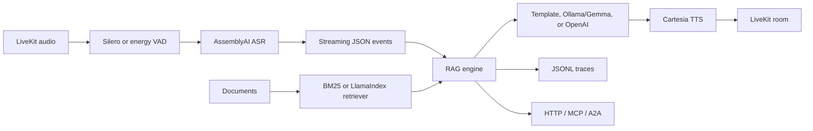

# Real-Time Voice RAG Agent

A production-shaped voice RAG project that turns static document search into natural voice conversation. The core runs offline with no paid services; provider adapters are ready for LiveKit room transport, AssemblyAI transcription, Ollama/Gemma or OpenAI reasoning, Cartesia TTS, MCP tools, and A2A task interoperability.

## What It Does

- Streams one JSON event envelope across CLI, HTTP, A2A, MCP, and voice transports.
- Retrieves grounded chunks from local documents with deterministic BM25 for tests.
- Supports optional LlamaIndex retrieval for production vector or hybrid search.
- Streams model deltas from Ollama's local JSON API or OpenAI's Responses API.
- Keeps ASR, retrieval, reasoning, TTS, tracing, and transport as separate adapters.
- Records trace JSONL files for latency analysis and eval debugging.

## Quick Start

```bash
python3 -m venv .venv
source .venv/bin/activate
pip install -e .
PYTHONPATH=src python3 -m voice_rag_agent.cli query "How does the agent keep latency low?"
```

Stream the same turn as NDJSON:

```bash
PYTHONPATH=src python3 -m voice_rag_agent.cli query "What do MCP and A2A expose?" --stream
```

Simulate a voice turn:

```bash
PYTHONPATH=src python3 -m voice_rag_agent.cli voice-demo "What services are used for transcription and TTS?"
```

Run evals:

```bash
PYTHONPATH=src python3 -m voice_rag_agent.cli eval
```

Run the HTTP API after installing the API extra:

```bash
pip install -e ".[api]"
PYTHONPATH=src python3 -m voice_rag_agent.cli serve --host 127.0.0.1 --port 8000
```

## Configuration

Copy `.env.example` to `.env` and export values in your shell or process manager. The offline default is:

```bash
VOICE_RAG_REASONER=template
VOICE_RAG_DATA_DIR=data/sample_docs
```

For Ollama/Gemma:

```bash
ollama pull gemma3:4b
VOICE_RAG_REASONER=ollama
OLLAMA_MODEL=gemma3:4b
```

For OpenAI, set both values explicitly:

```bash
VOICE_RAG_REASONER=openai
OPENAI_API_KEY=...
OPENAI_MODEL=...
```

## Architecture



The core package is dependency-light so tests and demos run anywhere. Production integrations live behind narrow adapters in `src/voice_rag_agent/integrations` and `src/voice_rag_agent/protocols`.

## Project Layout

- `src/voice_rag_agent/rag`: document loading, BM25 cache, prompting, streaming RAG engine.
- `src/voice_rag_agent/llm`: deterministic, Ollama, and OpenAI reasoners.
- `src/voice_rag_agent/voice`: ASR/TTS protocols, VAD, voice orchestration.
- `src/voice_rag_agent/protocols`: A2A and MCP surfaces.
- `src/voice_rag_agent/api.py`: FastAPI query and streaming endpoints.
- `data/sample_docs`: small corpus for demos and tests.
- `tests`: standard-library unittest suite.

## Latency Strategy

The agent optimizes perceived latency by gating speech before transcription, triggering retrieval only on final transcripts, caching repeated queries, keeping top-k small, streaming answer deltas, and letting TTS emit small chunks as soon as text is ready.

Trace files are written to `traces/<trace_id>.jsonl` when `VOICE_RAG_ENABLE_TRACING=true`. Each trace records event timings and spans for retrieval and reasoning.

## Production Wiring

1. Replace `AssemblyAITranscriptSource.stream()` with AssemblyAI's streaming client.
2. Replace `CartesiaTTS.synthesize()` with Cartesia audio chunk streaming.
3. Complete `integrations/livekit_worker.py` by connecting LiveKit audio frames to ASR and TTS output.
4. Use `LlamaIndexRetrieverAdapter` or a vector-store-backed retriever when semantic recall matters.
5. Export traces to OpenTelemetry if you install the `observability` extra.

The RAG engine does not care which transport calls it. That makes local evals, HTTP requests, MCP tool calls, A2A tasks, and live voice turns share one behavior.
